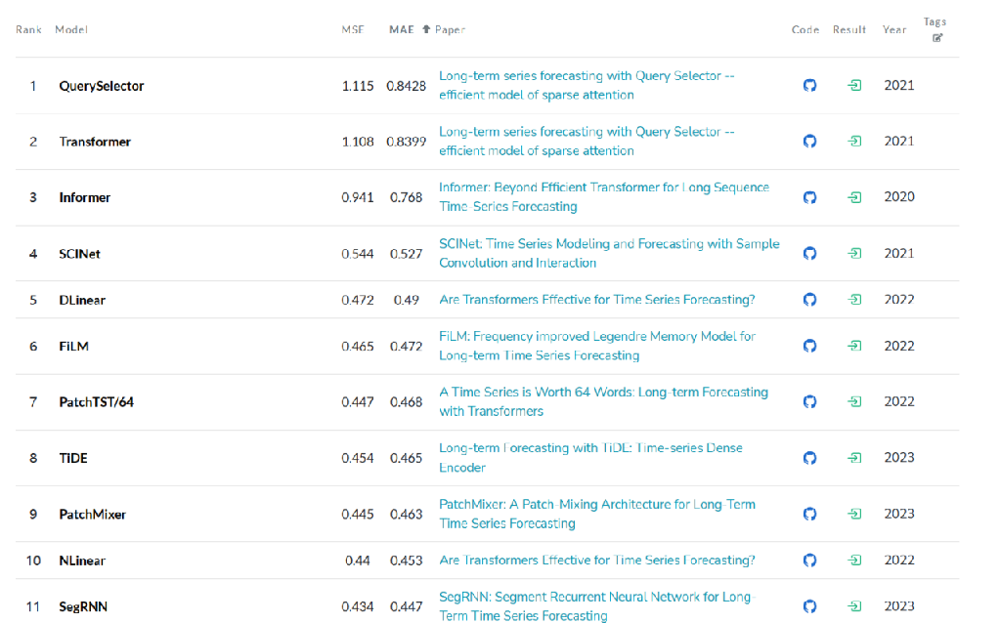

# Time-series prediction using deep learning methods in traffic flow
 YeQing（U2302161）
## Background
Traffic flow prediction is a fundamental problem in transportation engineering. It is important for traffic management and planning, traffic congestion reduction, and traffic engineering. The prediction of traffic flow is a complex task, which requires a combination of various factors, such as road network, traffic volume, and historical traffic data.

### Current Methodology
The proposed methodology is based on deep learning methods. The deep learning models include Transformer, MLP, CNN, RNN and KNN.The Transformer model is a powerful model that can effectively capture the sequential information of traffic data. The MLP model is a simple model that can effectively capture the spatial information of traffic data. The CNN model is a model that can effectively capture the spatial and temporal information of traffic data. The RNN model is a model that can effectively capture the sequential information of traffic data. The KNN model is a simple model that can effectively capture the spatial information of traffic data.

My Target of predict contains these three factors.
1.Accuracy:The accuracy of the model will be evaluated using various metrics such as R-squared (R2), Root Mean Square Error (RMSE), and Accuracy (ACC) and so on. These metrics will provide a comprehensive understanding of the model’s performance in terms of both bias and variance. 
2.Prediction Length: In the context of traffic flow prediction, the model should be capable of forecasting up to a minimum duration of 4 hours. This is to ensure that the predictions are practical and useful for real-world applications, such as traffic management and route planning.
3.Complexity: The complexity of the model, in terms of computational time and accuracy, will be compared and analyzed against mainstream prediction models. This will provide insights into the trade-off between the model’s performance and its computational efficiency.

## Application Scenarios
